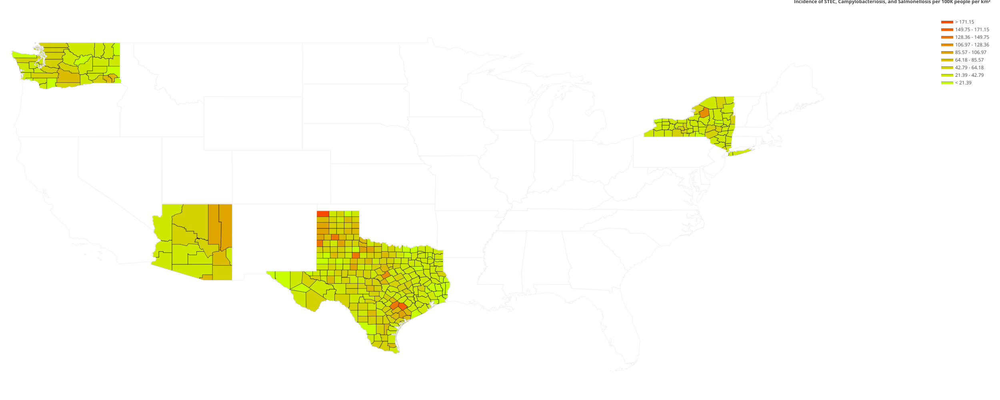
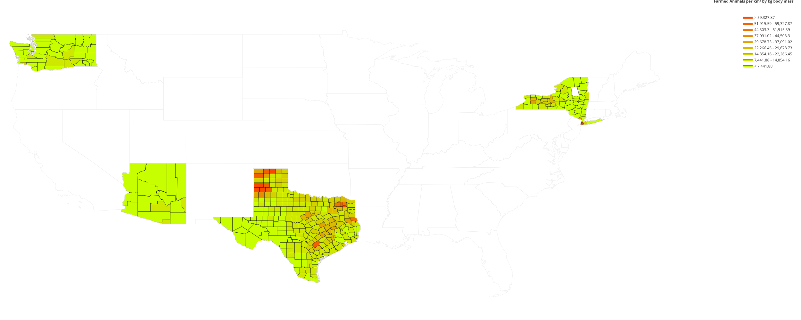

# Animal Agriculture

**Summary:** An exploration of public data on animal agriculture and public health. 

### Data Sources

 - USDA Census
 - Department of Health Data from:
   - Texas
   - New York
   - Washington
   - Ariona

### Tools used
 - NumPy (fast vectorized operations)
 - pandas (fast heterogeneous arrays)
 - python-tabula (extract tables from pdf)
 - plotly figure factory for cloropleths
 
### Results

